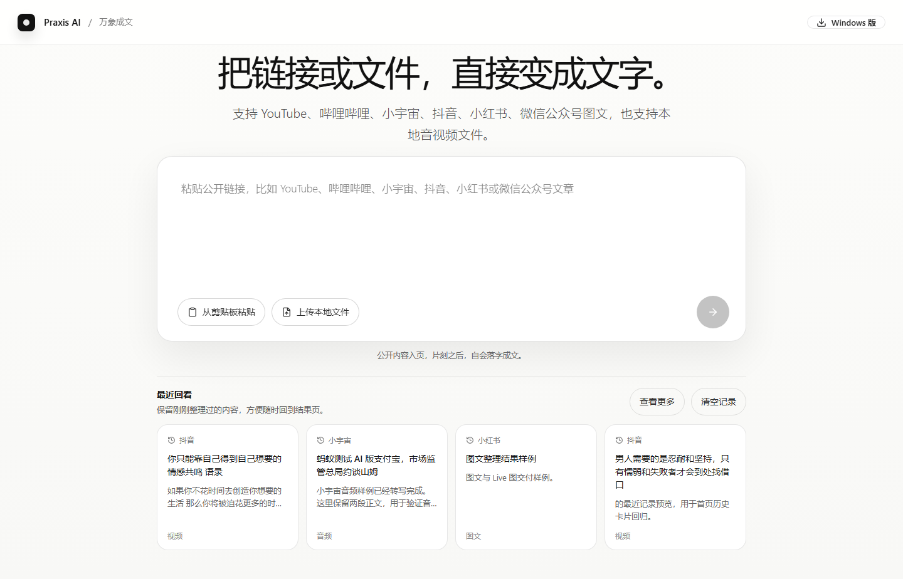

# Praxis AI｜无界笃行 / 万象成文

把公开视频、播客、图文链接或本地音视频，整理成可阅读、可复制、可下载的文字与媒体。

[在线体验](https://wanxiang.praxisai.online) · [下载 Windows 版](https://github.com/qinxujunai/Audio2Text/releases/latest/download/Wanxiang-Windows-x64-Setup.exe) · [观看 12 秒演示](docs/assets/wanxiang-demo.mp4)



Windows 桌面端是完整主产品：安装包自带处理服务，不要求目标电脑安装 Python。首次使用下载约 222 MB 的 SenseVoice int8 与 FFmpeg 运行组件，不额外下载多套模型；浏览器提取复用 Windows 自带 Edge，文件在本机处理。运行时会自动选择兼容的 CPU/GPU 路径，加速引擎不可用时回落到轻量 CPU 模式。云端版本用于限额体验。

当前只做三件事：

- 音频 / 视频转文字
- 图文链接提取正文与正文图片
- 预览并下载原视频、原音频、图片与文本交付件

当前不做这些：

- 账号体系
- 支付 / 套餐 / 积分
- 多工作台 / Agent 后台
- 平台化配置中心

## 当前产品形态

- 首页保持单页 Hero 输入。
- 提交后同页显示处理中，不跳后台工作台。
- 完成后同页展开结果页，不切换到旧式分析面板。
- 结果页 Hero 只承担标题与摘要说明，不吞长正文。
- 桌面端结果页采用“上方双栏主内容 + 下方 meta footer”：
  - 左栏是正文卡片，正文在卡片内部滚动。
  - 右栏是视频预览区，或图片网格列表区；点击图片后进入全屏级模糊背景查看层。
  - 下方 meta footer 采用自然流式标签排布；标题按内容宽度显示并在过长时截断，平台 / 内容类型 / 查看来源紧随其后。
- 手机与窄屏下保持自然纵向流，不强行锁一屏高度。

## 当前交付规则

### 文本

- `primary_text` 表示正式交付正文。
- `复制全文` 会按真实内容自适应：
  - 有真实 Markdown 时复制 Markdown
  - 没有时复制纯正文
- `.txt` 始终保留。
- `.md` 只在真实 Markdown 可用时出现。

### 视频

- 页面预览优先 `preview_media`。
- 下载原视频使用 `source_media`；有音轨时同时提供 `source_audio`。
- 页面不额外叠自定义悬浮全屏 / 下载按钮，沿用浏览器原生控件。
- 预览件与下载原件不是同一个交付目标，不应混为一谈。

### 图文与 Live 图

- 图文结果优先交付正文图片区。
- 微信公众号图文在正文图片区与图片文章模板之间按内容去重，避免封面图与正文首图重复交付。
- 图文图片较多时，处理页会显示真实的下载与打包进度，不应长期停在固定百分比。
- 图片结果页默认先显示图片列表；点击任一图片后，打开全屏级模糊背景查看层，点击图片外区域可关闭，页码进入底部工具条，左右切换按钮贴近当前媒体区域。
- 图片展示采用“本地优先、远端兜底”：本地图片 artifact 已就绪时优先本地显示与下载，未就绪时才回退源图即时浏览。
- `images.zip` 未就绪时不阻塞结果页完成，只延后“全部下载”按钮可用。
- 查看层支持左右切换、下载当前图片；鼠标滚轮用于切换上一张 / 下一张，静态图通过底部工具条显式缩放、旋转，并在放大后支持拖拽平移。
- Live 图进入查看层后默认直接进入动态态，按真实视频比例显示，仍可切回静态图。
- 小红书 Live 图命中动态资源时，交付“静态图 + Live 片段”。
- 图片卡片默认不展示 `KB` 体积、底部 `Live` 主按钮或居中的“查看图片”文案按钮。
- 卡片区只保留轻量 hover 查看图标、`LIVE` 标记与下载入口；桌面端 Live 图恢复悬停即播。

### 最近记录

- 首页最近记录默认显示 4 条，展开后最多 12 条。
- 支持单条删除撤销。
- 支持清空全部后撤销。
- 失败记录默认不进入首页最近记录主列表。

## 当前支持平台

最近一次 live smoke：2026-08-11。平台页面会变化，表格记录的是可复核状态，不是永久承诺。

| 平台           | 当前状态       | 主链路                                                        | 最近验证 |
| -------------- | -------------- | ------------------------------------------------------------- | -------- |
| 哔哩哔哩       | 通过           | 官方 view/player API → progressive/DASH → `yt-dlp`           | 视频、文字、视频与音频交付件通过 |
| 小宇宙         | 通过           | 页面音频 → 本地转写                                           | `.m4a`、文字与音频交付件通过 |
| 抖音           | 通过但高波动   | 公开链路 → 浏览器会话 → `yt-dlp`                              | 公开视频、文字与媒体交付件通过 |
| 小红书         | 图文 / Live 通过 | 分享链接 → 结构化数据 → 浏览器会话                          | 15 图、14 个 Live 片段通过；视频样本当前触发平台会话验证 |
| 微信公众号图文 | 通过           | 直连 → 浏览器会话                                             | 正文与图片样本通过 |
| YouTube        | 网络条件可用   | 字幕 → EJS/`yt-dlp` → 媒体转写                                | 当前中国网络连接 API 超时，错误归因通过 |

## Windows 版

1. 下载 `Wanxiang-Windows-x64-Setup.exe`。
2. 安装并打开万象成文。
3. 首次使用按界面提示安装本地识别与媒体组件。

安装包、运行包与发布产物都提供 SHA-256；GitHub Actions 同时生成 SBOM 与 provenance attestation。桌面端只监听随机 loopback 端口，并用每次启动生成的短期令牌保护本地 API。

## 项目级环境隔离

默认只使用项目内运行时目录：

```text
.venv
workspace/runtime/models
workspace/runtime/playwright-browsers
workspace/runtime/ffmpeg
workspace/runtime/browser-profile
workspace/captures
workspace/artifacts
workspace/temp
workspace/logs
```

补充说明：

- 高波动平台建议保留 `workspace/runtime/browser-profile` 作为项目级持久会话目录。
- 若本地仍落到 `Assets/Models/FasterWhisper/...`，当前版本会把它视为 legacy fallback，并在 preflight 给出 warning。

## 仓库结构

```text
app/                FastAPI、平台提取、结果合流、存储
web/                前端源码（Vite + React）
frontend/dist/      前端构建产物，供后端静态服务使用
docs/               部署、验收、发布口径
scripts/            启动脚本、浏览器会话刷新等
tests/              自动化测试
workspace/          运行期数据目录
tests_runtime/      测试临时产物，可清理
```

目录说明：

- `web/` 是前端源码目录，应编辑这里。
- `frontend/dist/` 是构建输出目录，不应手动修改。
- `tests_runtime/` 是测试与截图临时产物目录，可清理。
- `workspace/temp/` 是运行期临时目录，可按需清理。
- 推荐统一使用 `.\.venv\Scripts\python.exe -m scripts.cleanup_runtime --yes` 清理测试截图、临时探针、旧 smoke 结果和历史调试目录。
- `Assets/Models/...` 仍是 legacy 模型兜底目录，未迁移前不应直接删除。

## 本地启动

### 1. 一键启动产品并生成公网链接

```powershell
.\start_api.bat
```

这个入口会先做启动自检，再启动本地服务和临时公网链接。自检会自动处理：

- `.venv` 缺失、损坏或指向失效 Python 时，优先用 `uv` 重建 Python 3.11 环境并安装锁定依赖。
- `frontend/dist` 缺失时，检测 `npm` 并自动构建前端产物。
- 启动前检查模型、ffmpeg、Playwright Chromium、CUDA runtime、端口和运行时配置。

窗口里出现 `[PUBLIC URL]` 后，把那个链接发给别人即可。电脑和窗口都要保持开启。

只做本地开发或排障时，用本地模式：

```powershell
$env:AUDIO2TEXT_LOCAL_ONLY = "1"
.\start_api.bat
```

默认端口是 `8000`；端口被占用时可临时换端口：

```powershell
$env:AUDIO2TEXT_API_PORT = "8001"
.\start_api.bat
```

### 2. 运行时资源

启动入口会检查这些项目级资源；缺失时会给出明确中文提示：

```text
workspace/runtime/models/faster-whisper/medium
workspace/runtime/playwright-browsers
workspace/runtime/ffmpeg/ffmpeg.exe
workspace/runtime/ffmpeg/ffprobe.exe
```

高波动平台建议保留 `workspace/runtime/browser-profile` 作为项目级浏览器会话。若该目录为空，产品仍可启动，但抖音 / 小红书成功率会下降；可用下面命令刷新：

```powershell
.\.venv\Scripts\python.exe -m scripts.refresh_browser_session
```

### 3. 排障用手工命令

日常不需要手工安装依赖；只有自检失败需要定位时再用这些命令：

```powershell
uv venv --clear --seed --python 3.11 .venv
uv pip install --python .\.venv\Scripts\python.exe -r requirements.txt --link-mode copy --compile-bytecode
```

底层 API 仍可直接运行：

```powershell
.\.venv\Scripts\python.exe -m scripts.start_api
```

### 4. 本地访问

```text
http://127.0.0.1:8000
```

公网链接会写入：

```text
tests_runtime/public_preview/current_url.txt
```

注意：

- 这是临时演示链接，不是正式云部署。
- 电脑不能关，启动窗口不能关。
- 如果出现 localtunnel 的 IP 确认页，按窗口提示输入页面上显示的 IP 后继续。
- 用户可见启动入口只保留 `start_api.bat`；`scripts/start_api_bootstrap.ps1` 负责自检和自愈，`scripts/start_cloudflare_tunnel.py` 和 `scripts/start_localtunnel.py` 只是内部兜底 helper。

## 配置

示例配置见 [audio2text.settings.example.json](audio2text.settings.example.json)。

关键项：

- `workspace_dir`
- `model_path`
- `ffmpeg_path`
- `transcription_provider`
- `openai_compatible_base_url`
- `openai_compatible_api_key`
- `openai_compatible_model`
- `allowed_origins`

## 转写模型评测

本地 Faster-Whisper 模型应通过同一批音频样本评测后再切换。评测脚本见：

```powershell
.\.venv\Scripts\python.exe -m scripts.benchmark_transcription --help
```

评测方法与当前基线记录见 [docs/transcription-benchmark.md](docs/transcription-benchmark.md)。

默认值说明：

- `language` 当前默认是 `auto`
- `capture_history_limit` 当前默认是 `12`
- `daily_capture_limit` 当前默认是 `12`（每 IP 每天最多提交次数）
- `max_video_duration_minutes` 当前默认是 `30`（视频最长时长）
- `max_upload_size_mb` 当前默认是 `200`（上传文件大小上限）
- `admin_ips` 当前默认为空（管理员 IP，不受次数限制）

## Docker

镜像构建：

```powershell
docker build -t praxis-audio2text .
```

### 方式一：挂载本地 Faster-Whisper 模型

```powershell
docker run --rm --name praxis-audio2text -p 8000:8000 `
  -v "${PWD}\workspace:/app/workspace" `
  praxis-audio2text
```

前提：

- `workspace/runtime/models/faster-whisper/medium` 已有可用模型文件。
- 如需抖音 / 小红书浏览器链路，挂载后的 `workspace/runtime/playwright-browsers` 里也要有 Chromium runtime。

### 方式二：使用 OpenAI-compatible 转写

如果不挂载本地模型目录，应改用 `openai_compatible`，并提供完整转写配置：

```powershell
docker run --rm --name praxis-audio2text -p 8000:8000 `
  -v "${PWD}\workspace:/app/workspace" `
  -e AUDIO2TEXT_TRANSCRIPTION_PROVIDER=openai_compatible `
  -e AUDIO2TEXT_OPENAI_COMPATIBLE_BASE_URL="https://your-provider.example.com/v1" `
  -e AUDIO2TEXT_OPENAI_COMPATIBLE_API_KEY="your-api-key" `
  -e AUDIO2TEXT_OPENAI_COMPATIBLE_MODEL="gpt-4o-mini-transcribe" `
  praxis-audio2text
```

当前约定：

- Docker 构建会在镜像内自行完成前端构建。
- 宿主机不需要预先提供 `frontend/dist`。
- 容器内默认使用镜像自带 `ffmpeg`。
- 镜像只复制运行时真正需要的 `app/`、`scripts/`、`requirements.txt`、`audio2text.settings.example.json` 和构建后的 `frontend/dist/`。
- 镜像默认按 `cloud_preview` 预览模式启动；未配置模型或 OpenAI-compatible provider 时，首页仍可访问，音视频转写会给出“云端预览未配置转写服务”的明确失败提示。
- Faster-Whisper 模型默认不内置在镜像里；要让本地转写可用，必须挂载 `workspace/runtime/models/faster-whisper/medium`。
- `-v "${PWD}\workspace:/app/workspace"` 会覆盖容器内 `/app/workspace`，因此 Playwright 浏览器运行时、模型、浏览器会话都以宿主机挂载目录为准。

## Hugging Face Spaces

仓库根目录的 README 顶部已保留 Spaces Docker metadata：

```yaml
sdk: docker
app_port: 8000
```

上传 Docker Space：

```powershell
.\.venv\Scripts\python.exe -m scripts.deploy_huggingface_space
```

如果没有登录 Hugging Face，先执行：

```powershell
.\.venv\Scripts\hf.exe auth login
```

默认 Space 名称是 `wanxiang-chengwen-preview`，脚本会读取当前 HF 登录用户并部署到 `你的用户名/wanxiang-chengwen-preview`。如果要指定别的 Space：

```powershell
.\.venv\Scripts\python.exe -m scripts.deploy_huggingface_space your-username/your-space-name
```

Spaces 预览不把本地 Faster-Whisper 模型打进镜像，默认使用 OpenAI-compatible 转写服务。需要在 Space Variables / Secrets 中配置：

```text
AUDIO2TEXT_API_HOST=0.0.0.0
AUDIO2TEXT_API_PORT=8000
AUDIO2TEXT_DEPLOYMENT_MODE=cloud_preview
AUDIO2TEXT_PUBLIC_PREVIEW_MODE=1
AUDIO2TEXT_ALLOW_DEGRADED_START=1
AUDIO2TEXT_TRANSCRIPTION_PROVIDER=openai_compatible
AUDIO2TEXT_OPENAI_COMPATIBLE_BASE_URL=<your-provider-base-url>
AUDIO2TEXT_OPENAI_COMPATIBLE_API_KEY=<secret>
AUDIO2TEXT_OPENAI_COMPATIBLE_MODEL=<model>
```

脚本会自动写入前 6 个公开变量。`AUDIO2TEXT_OPENAI_COMPATIBLE_*` 三项涉及实际转写服务，其中 API key 必须放 Space Secret；没有配置时首页仍可访问，图文和字幕类链接可先体验，本地音视频文件会提示需要配置转写服务。

注意：

- API key 只能放在 Space Secret，不要写入仓库文件。
- 免费 Space 的 `workspace` 不应当成正式持久存储。
- 这条路径用于预览和演示，不等同正式生产上线。

## 最小检查

日常质量门：

```powershell
.\.venv\Scripts\python.exe -m scripts.verify
```

只跑后端侧质量门：

```powershell
.\.venv\Scripts\python.exe -m scripts.verify --backend-only
```

加真实本地转写烟测：

```powershell
.\.venv\Scripts\python.exe -m scripts.verify --transcribe-smoke-file E:\path\to\sample.wav
```

项目运行时体检：

```powershell
.\.venv\Scripts\python.exe -m scripts.doctor
```

后端测试：

```powershell
.\.venv\Scripts\python.exe -m unittest discover -s tests -p "test_*.py"
```

前端类型检查：

```powershell
cd web
npm exec tsc -- --noEmit
```

前端构建：

```powershell
cd web
npm run build
```

一键执行本地发布门槛：

```powershell
.\.venv\Scripts\python.exe -m scripts.release_gate
```

只跑非 Docker 门槛：

```powershell
.\.venv\Scripts\python.exe -m scripts.release_gate --skip-docker
```

Docker 构建默认 5 分钟超时；如果卡住，不要盲等，先看最后输出的构建步骤：

```powershell
.\.venv\Scripts\python.exe -m scripts.release_gate --docker-build-timeout 300
```

演示前建议先确认默认端口没有旧服务：

```powershell
netstat -ano | findstr ":8000"
```

最终上线前必须执行带 live smoke 的最终门槛：

```powershell
.\.venv\Scripts\python.exe -m scripts.release_gate `
  --final `
  --with-live-smoke `
  --live-smoke-base-url "http://127.0.0.1:8000"
```

## 文档

- [AGENTS.md](AGENTS.md)
- [docs/deployment.md](docs/deployment.md)
- [docs/verification.md](docs/verification.md)
- [docs/release-ready.md](docs/release-ready.md)

## Capture Diagnostics

Slow or failed captures can be inspected without changing product behavior:

```powershell
.\.venv\Scripts\python.exe -m scripts.diagnose_capture <capture_id>
```

Runtime diagnostics stay inside the project workspace:

- Per-capture stage traces: `workspace/logs/capture_traces/<capture_id>.jsonl`
- Rotated service logs: `workspace/logs/*.log`
- Capture artifacts: `workspace/artifacts/<capture_id>/`

Each trace records bounded stages such as `resolve`, `extract`, `transcribe`, `compose`, `artifact`, `done`, and `failed`. The capture pipeline log also writes a final stage-duration summary so slow tasks can be separated into platform extraction, worker recovery, transcription, or artifact generation.

## Result Layout Invariants

- Result hero titles are clamped on desktop so long titles cannot squeeze the text and media panels.
- Desktop result pages keep the main text panel and media panel visually equal-height; long text scrolls inside the text card.
- Bottom meta footer uses compact inline chips. The title chip truncates by display width, while `平台`, `内容类型`, and `查看来源` stay compact and remain clickable.
